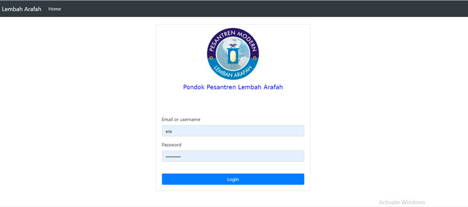
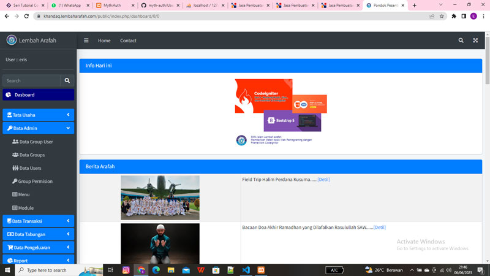
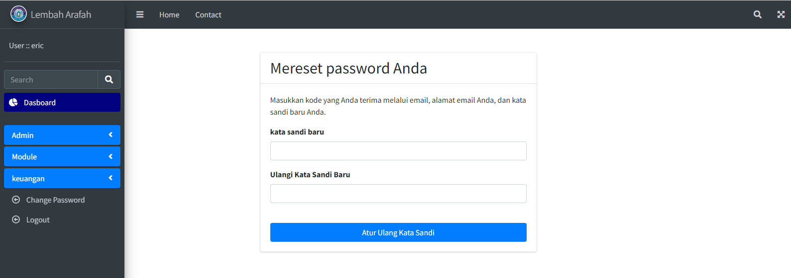

# Web Application with FW CodeIgniter 4

Simple Management Menu


Tampilan Menu


Reset Password


## Prerequisites

The following requirements must be met to be able to use the GitHub Actions Importer:

- Apache, Php and MySql Must be installed.

## 1. Installation CodeIgneter 4

### Create directory project in root

### example

For xampp with mysql database

```bash
mkdir c:\xamp\htdocs\CI_Simple_Login
```

### Change Directory

```bash
cd c:\xamp\htdocs\CI_Simple_Login
```

### execute this command

```bash
composer create-project codeigniter4/appstarter .
```

## 2. Installation Myth:Auth

### Untuk Login

```bash
composer require myth/auth
```

### edit app/Config/Autoload.php

```bash
    $psr4 = [
        'Config'      => APPPATH . 'Config',
        APP_NAMESPACE => APPPATH,
        'App'         => APPPATH,
        'Myth\Auth'   => APPPATH . 'ThirdParty/myth-auth/src',
    ];
```

### execute this command

```bash
composer create-project codeigniter4/appstarter .
```

### MY Configuration

Group Default "user"
My Conf requireActivation = null

### edit \vendor\myth\auth\src\Config\Auth.php

```bash
public $defaultUserGroup = 'user';
```

```bash
public $requireActivation = null;
```

### quick installation

1. Create Folder CI_Simple_Login inside htdocs and copy all source code
2. execute dummydata.sql in mysql server (phpmyadmin)
3. login : admin pass : 123

## Contributing

Pull requests are welcome. For major changes, please open an issue first
to discuss what you would like to change.

Please make sure to update tests as appropriate.

## License

[MIT](https://choosealicense.com/licenses/mit/)

"Intinya Bebas dan Gratis"
