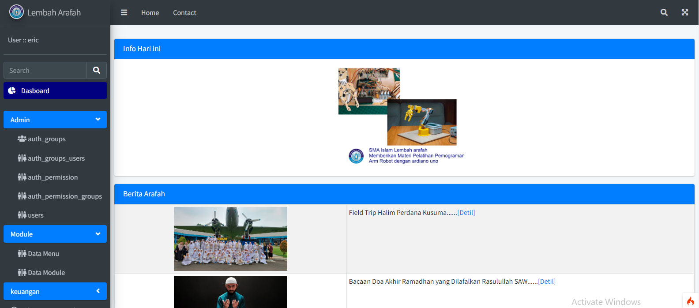
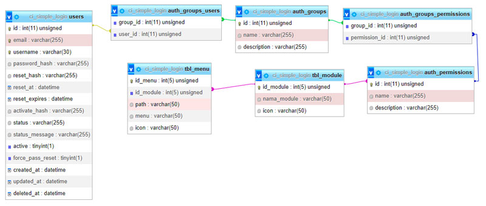

# Simple Login and Management Menu cek

- FW CodeIgniter 4,

- template AdminLTE,

- Auth sistem Myth/Auth,

- database MySql

#### Screenshot Login


#### Screenshot Menu



#### Screenshot Reset Password


#### Screenshot Relationsip table



## Prerequisites

The following requirements must be met to be able to use the GitHub Actions Importer:

- Apache, Php and MySql Must be installed.

## 1. Installation CodeIgneter 4

### Create directory project in root

### example

For xampp with mysql database

```bash
mkdir c:\xamp\htdocs\CI_Simple_Login
```

### Change Directory

```bash
cd c:\xamp\htdocs\CI_Simple_Login
```

### execute this command

```bash
composer create-project codeigniter4/appstarter .
```

## 2. Installation Myth:Auth

### for Login

```bash
composer require myth/auth
```

### Copy all and replace

1. copy and replace all source code inside CI_Simple_Login
2. create databasename ci_simple_login in ur mysql database execute dummydata.sql in mysql server (phpmyadmin)
3. rename file env to .env
4. browse from browser http://localhost/CI_Simple_Login/public/
5. login : admin pass : 123

## Contributing

Pull requests are welcome. For major changes, please open an issue first
to discuss what you would like to change.

Please make sure to update tests as appropriate.

## License

[MIT](https://choosealicense.com/licenses/mit/)

"Intinya Bebas dan Gratis"

Eris Taufiq H
